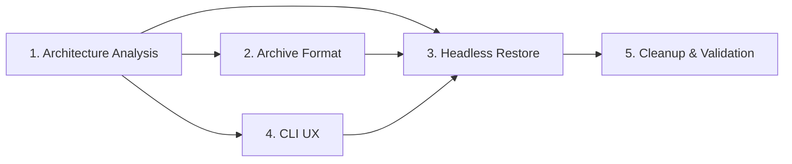

# Backuper — Agent Roles & Responsibilities

This document defines the agent breakdown for the Headless Restore implementation.

---

## 1. Architecture Analysis Agent

**Responsibilities:**
- Analyze the complete existing codebase before any changes
- Document the backup pipeline flow (9 step scripts in `modules/backup/steps/`)
- Document the WebUI restore flow (`backend/tasks.py` → `run_restore()`)
- Document the shared library patterns (`lib/common.sh`, `lib/runner.sh`)
- Document archive structure and restore.sh template
- Identify reusable patterns and helpers

**Deliverables:**
- Architecture diagram
- Restore workflow documentation
- Dependency map

**Relevant Resources:**
- `lib/common.sh` — Shared utilities (logging, pkg management, Docker)
- `lib/runner.sh` — Phase execution framework
- `modules/backup/run.sh` — Backup orchestrator pattern
- `modules/backup/steps/07-write-restore.sh` — Restore script template
- `modules/webui/backend/tasks.py` — WebUI restore logic

---

## 2. Backup Format & Archive Structure Agent

**Responsibilities:**
- Document `.tar.gz` archive internal structure
- Document `.stack-meta` provenance format
- Document `restore.sh` generated script behavior
- Document archive-of-archives (bundle) format
- Define detection heuristics for Case A vs Case B

**Deliverables:**
- Archive format specification
- Bundle detection algorithm

**Relevant Resources:**
- `modules/backup/steps/09-archive-service.sh` — Archive creation
- `modules/backup/steps/05-write-metadata.sh` — Metadata format
- `modules/backup/steps/07-write-restore.sh` — Restore script generation
- `backups/split_stacks/` — Example archives

---

## 3. Headless Restore Implementation Agent

**Responsibilities:**
- Implement `modules/restore/run.sh` — Main orchestrator
- Implement all step scripts (`01-intake.sh` through `06-cleanup.sh`)
- Implement entrypoints (`restore.sh`, `bin/restore`)
- Ensure behavioral parity with WebUI restore process
- Support all three intake cases (bundle, individual, directory)
- Implement intake loop with "add another?" for all cases

**Deliverables:**
- Complete `modules/restore/` module
- Public entrypoints

**Dependencies:**
- Architecture Analysis Agent (must complete first)
- CLI UX Agent (selection interface)
- Common library additions (`lib/common.sh`)

**Relevant Resources:**
- `modules/backup/run.sh` — Pattern to mirror
- `modules/webui/backend/tasks.py:72-176` — WebUI restore to replicate
- `modules/webui/backend/server.py:259-312` — Upload/bundle detection logic

---

## 4. CLI UX / Progress Bar Agent

**Responsibilities:**
- Implement progress bars using `pv` (pipe viewer)
- Implement `whiptail` checklist selection UI
- Implement text-based fallback selector
- Add shared utilities to `lib/common.sh`
- Ensure visual consistency with existing project CLI style
- Auto-install missing dependencies (`pv`, `whiptail`)

**Deliverables:**
- `extract_with_progress()` in `lib/common.sh`
- `ensure_restore_deps()` in `lib/common.sh`
- `modules/restore/steps/03-select-archives.sh`
- `modules/setup/00-install-deps.sh` update

**Relevant Resources:**
- `modules/setup/03-cockpit-install.sh` — whiptail usage pattern
- `modules/setup/00-install-deps.sh` — Dependency installation pattern
- `lib/common.sh` — Existing logging/formatting functions

---

## 5. Cleanup & Validation Agent

**Responsibilities:**
- Verify all scripts pass `bash -n` syntax check
- Verify shellcheck compliance
- Verify consistent code style with existing modules
- Verify cleanup leaves no temporary files
- Verify dry-run mode produces no side effects
- Verify final summary accuracy

**Deliverables:**
- Validation report
- Any bug fixes discovered during validation

**Relevant Resources:**
- All files in `modules/restore/`
- `lib/common.sh` — Additions to validate
- Existing scripts for style reference

---

## Agent Execution Order

For this implementation, all agent responsibilities were handled within a single execution context, as the scope was manageable and the dependencies between agents were tightly coupled.
